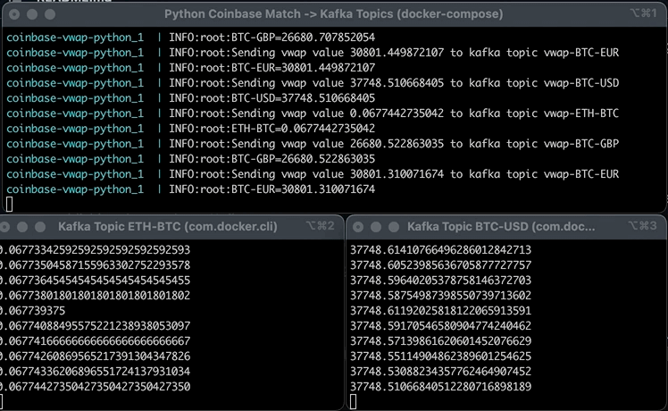

# coinbase-vwap-python

This program gets latest prices from Coinbase match websocket API and calculates its VWAP value, outputing to stdout and to a Kafka topic.

This is the Python version of https://github.com/flaviostutz/coinbase-vwap
Read its README in order to have more details.

## Demo

* The window on top is the program itself calculating the VWAP values and sending to Kafka
* The two windows below are a streaming of some Kafka topics to the console

## Usage

* Run the program without Kafka support

  * `docker-compose up --build`

* Run with kafka support

  * `docker-compose -f docker-compose-withkafka.yml up --build`
  * See Kafka messages by opening http://localhost:19000 and view the messages in the specific ProductId topic

## Run tests

python -m unittest test_weighted_avg

